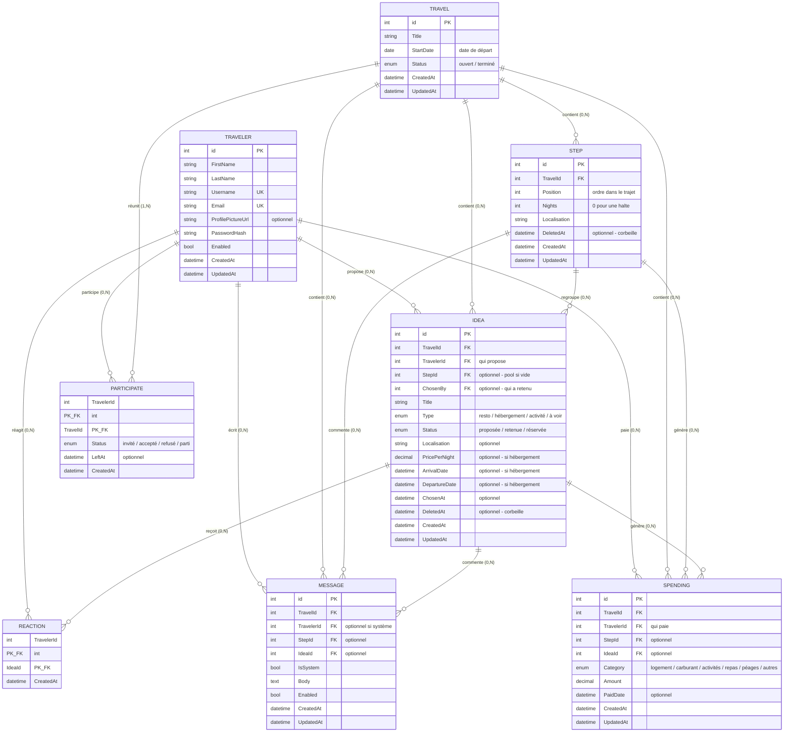

# Modèle de données

**Tout ce qui suit est à valider jeudi**

## Principes produit

- **Planifier, pas naviguer.** Sur la route, c'est Google Maps. L'app rassemble les idées et définit le trajet ensemble. L'ordre des étapes est fixé par l'utilisateur, pas optimisé.
- **L'étape est le trajet, l'idée est ce qu'on y fait.** L'étape dessine la ligne sur la carte. L'idée est une proposition rattachée à une étape ou au voyage : où dormir, manger, quoi voir.
- **Le ❤️ est un signal, pas une décision.** On en met sur autant d'idées qu'on veut, il ne déclenche rien. Retenir une idée est une action explicite et réversible.

## Schéma

## Notation

- `PK` clé primaire, `FK` clé étrangère, `UK` valeur unique
- `||--o{` : un vers plusieurs — la cardinalité est aussi écrite en clair sur chaque relation
- CreatedAt / UpdatedAt sont gérés automatiquement par Django (auto_now_add et auto_now). Reaction et Participate n'ont pas d'UpdatedAt : un ❤️ ne se modifie pas, et LeftAt porte déjà le changement d'état d'une participation.

## Détails des tables

- **Traveler** : un compte. Désactivable plutôt que supprimé.
- **Travel** : un voyage, avec sa date de départ. Aucun propriétaire : tous les participants ont les mêmes droits.
- **Participate** : qui participe à quel voyage et où en est son invitation. Une personne partie garde sa ligne, pour que les soldes restent justes.
- **Step** : un arrêt du trajet. `Position` donne l'ordre, `Nights` la durée (0 pour une halte). Les dates se déduisent de `Travel.StartDate` et du cumul des nuits.
- **Idea** : une proposition faite pour un voyage. Rattachée à une étape, ou libre dans le pool. Une idée d'hébergement porte en plus son prix et ses dates.
- **Reaction** : un ❤️ d'une personne sur une idée. Purement indicatif.
- **Message** : un message du chat, rattachable au voyage, à une étape ou à une idée. `IsSystem` distingue les notifications automatiques.
- **Spending** : une dépense, rattachable au voyage seul (carburant), à une étape (péage) ou à une idée (le resto qu'on a fait).

## Comportements en cas de suppression

- **Voyage** : on ne le supprime pas, on le quitte (comme un groupe WhatsApp). Il sort de sa liste, rien ne bouge pour les autres, et sa participation reste en base pour que les soldes restent justes.
- **Étape et idée** : corbeille (`DeletedAt`), restaurables. Protège des suppressions accidentelles à plusieurs.
- **Dépenses et messages** : conservés quoi qu'il arrive. Si leur étape ou leur idée disparaît, ils perdent juste leur rattachement (`ON DELETE SET NULL`). Exemple : les 240 CHF du camping restent au budget même sans l'étape Zermatt.
- **Réactions** : supprimées avec leur idée, un ❤️ ne veut rien dire sans elle.

`PricePerNight` est descriptif (« ce camping coûte 24 CHF/nuit »), `Spending` est de l'argent réellement sorti. Rien ne passe automatiquement de l'un à l'autre.

## Modifications et propositions à valider

| # | Changement | Pourquoi | Source |
|---|-----------|----------|--------|
| 1 | `Step` : `Position` + `Nights` remplacent `ArrivalDate` (+ `StartDate` sur `Travel`) | Sinon plusieurs arrêts le même jour sont indépartageables. Les dates se recalculent seules quand on insère une étape. | PV 18/07 |
| 2 | `Choice` + `Vote` → `Reaction` | La v2 imposait un vote exclusif. Le ❤️ est un signal : on en met sur autant d'idées qu'on veut. | PV 18/07 |
| 3 | `ChosenBy` / `ChosenAt` sur `Idea`, statut `réservée` ajouté | Trace l'acte de décision et permet le bouton annuler. Maquette : « À choisir » → « Réservé ». Choisir exclut, programmer non, même statut en base, un seul bouton avec un libellé qui change selon le type. | PV 18/07 |
| 4 | Pas de table hébergement séparée | Sa seule spécificité est l'exclusivité, réglée par un index unique partiel. Lien : https://docs.djangoproject.com/en/5.2/ref/models/constraints/#uniqueconstraint Le reste fonctionne à l'identique. | PV 18/07 |
| 5 | Valeurs de statuts fixées | Tâche du PV restée ouverte (voir ci-dessous). | PV 18/07 |
| 6 | Tables de statut → énumérations Django | Listes courtes et figées : `TextChoices` protège autant, sans table ni jointure. Schéma de 14 à 8 tables. lien : https://docs.djangoproject.com/en/5.2/ref/models/fields/#enumeration-types | |
| 7 | `TravelerRole` supprimé, aucun propriétaire | Mêmes droits pour tous. On quitte un voyage, on ne le supprime pas — et la ligne reste pour les soldes. | Maquette |
| 8 | `Spending` : un seul champ `Amount` | Aucun écran ne compare prévu et réel. En v2, l'estimation était obligatoire et le réel optionnel. | Maquette |
| 9 | `Spending` : ajout de `Category` | L'écran budget repose entièrement dessus. Absent de la v2 — le carburant n'est lié à aucune idée. | Maquette |
| 10 | `StepId` / `IdeaId` optionnels sur `Spending` et `Message` | Une dépense relève du voyage (carburant), d'une étape (péage) ou d'une idée (le resto). Permet aussi le transfert à la promotion. | Maquette |
| 11 | `Idea` : dates rendues optionnelles | Un resto n'a pas de date d'arrivée. Mais deux hébergements successifs au même endroit, si. | |
| 12 | `DeletedAt` sur `Step` et `Idea` | Édition à quatre en simultané : la suppression accidentelle est un cas réel, et les cascades la rendent irrattrapable. | Maquette |
| 13 | Promotion idée → étape : l'idée disparaît | Sinon le même lieu s'affiche deux fois. Dépenses et messages sont transférés vers l'étape. | |
| 14 | `PricePerNight` sur `Idea` | Affiché dans la maquette (« 95 CHF/nuit »), absent de la v2. | Maquette |

### Statuts (point 5)

- **`Travel`** : ouvert → terminé. Le passage à « terminé» clôt les réactions. Pas de statut « annulé » : un voyage qui ne se fera jamais, on le quitte.
- **`Idea`** : proposée → retenue → réservée. Retour en arrière toujours possible. Une idée non retenue reste dans le pool indéfiniment : elle ne disparaît jamais faute de ❤️, ce serait transformer le signal en décision automatique.
- **`Participate`** : invité → accepté / refusé / parti.
